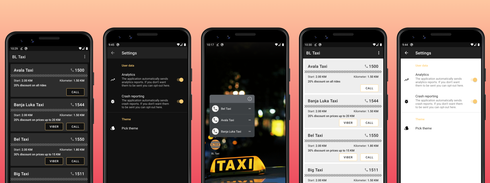

    

<h3 align="center">
    The fastest way to call a taxi in Banja Luka
</h3>

    
    
    
    
    

-------

    

Project characteristics 🚀
-------
This project brings to the table set of best practices, tools, and solutions:

* 100% [Kotlin](https://kotlinlang.org/)
* Modern architecture (Clean Architecture, Multi-Module setup, Model-View-ViewModel)
* [Android Jetpack](https://developer.android.com/jetpack)
* Single-activity architecture, using the [Navigation component](https://developer.android.com/guide/navigation/navigation-getting-started)
* CI pipeline ([Bitrise](https://app.bitrise.io/app/b8b8722ee9645ad8#/builds))
* Testing (Using [Jacoco](https://github.com/jacoco/jacoco) for test coverage)
* Dependency Injection
* Material Design (Dark theme)

Built With 🛠
-------
- [Kotlin](https://kotlinlang.org/) - First class and official programming language for Android development.
- [Coroutines](https://kotlinlang.org/docs/reference/coroutines-overview.html) - Kotlin's way of way of writing asynchronous, non-blocking code
- [Android Architecture Components](https://developer.android.com/topic/libraries/architecture) - Collection of libraries that help you design robust, testable, and maintainable apps
  - [LiveData](https://developer.android.com/topic/libraries/architecture/livedata) - Data objects that notify views when the underlying data changes
  - [ViewModel](https://developer.android.com/topic/libraries/architecture/viewmodel) - Stores UI-related data that isn't destroyed on UI changes
  - [DataBinding](https://developer.android.com/topic/libraries/data-binding) - Allows you to bind UI components in your layouts to data sources in your app using a declarative format rather than programmatically
  - [WorkManager](https://developer.android.com/topic/libraries/architecture/workmanager) - Makes it easy to schedule deferrable, asynchronous tasks that are expected to run even if the app exits or device restarts
  - [Room](https://developer.android.com/topic/libraries/architecture/room) - SQLite object mapping library
- [Material Components for Android](https://github.com/material-components/material-components-android) - Modular and customizable Material Design UI components for Android
- [Navigation Component](https://developer.android.com/guide/navigation) - Helps you implement navigation, from simple button clicks to more complex patterns, such as app bars and the navigation drawer
- [Koin](https://github.com/InsertKoinIO/koin) - Dependency Injection Framework
- [Retrofit](https://square.github.io/retrofit/) - A type-safe HTTP client for Android and Java
- [Google Analytics](https://firebase.google.com/docs/analytics) - Free app measurement solution that provides insight on app usage and user engagement
- [Firebase Crashlytics](https://firebase.google.com/docs/analytics) - Lightweight, realtime crash reporter that helps you track, prioritize, and fix stability issues that erode your app quality

Tested With 🔬
-------
- [JUnit 4](https://junit.org/junit4/) - Simple framework to write repeatable tests
- [mockito](https://github.com/mockito/mockito) - Most popular Mocking framework for unit tests
- [mockito-kotlin](https://github.com/nhaarman/mockito-kotlin) - Provides helper functions to work with Mockito in Kotlin
- [Truth](https://github.com/google/truth) - Makes your test assertions and failure messages more readable
- [Robolectric](https://github.com/robolectric/robolectric) - Runs tests in a simulated Android environment inside a JVM without the overhead of an emulator

Download
-------

Find this repository useful? :heart:
-------
Support it by joining __[stargazers](https://github.com/VladimirWrites/BLTaxi/stargazers)__ for this repository. :star:  
And __[follow](https://github.com/VladimirWrites)__ me for my next creations! 🤩

License
-------

     Copyright 2020 Vladimir Jovanović

     Licensed under the Apache License, Version 2.0 (the "License");
     you may not use this file except in compliance with the License.
     You may obtain a copy of the License at

         http://www.apache.org/licenses/LICENSE-2.0

     Unless required by applicable law or agreed to in writing, software
     distributed under the License is distributed on an "AS IS" BASIS,
     WITHOUT WARRANTIES OR CONDITIONS OF ANY KIND, either express or implied.
     See the License for the specific language governing permissions and
     limitations under the License.
